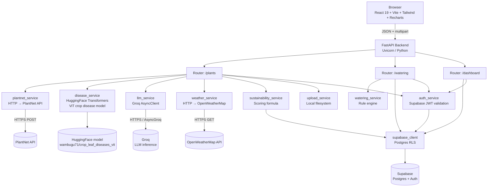
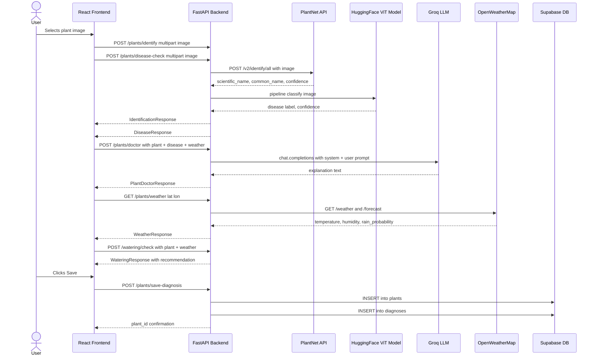

# PlantCare AI — Architecture Analysis

> **Produced with IBM Bob assistance** | Grounded in actual source code

---

## 1. High-Level Architecture

PlantCare follows a standard client–server architecture with four external service integrations and one managed backend-as-a-service (Supabase). There is no microservices layer; all backend logic is contained within a single FastAPI process.

```
┌─────────────────────────────────────────────────────────────────────┐
│  Browser (React SPA)                                                │
│  React 19 + Vite + Tailwind CSS v4 + Recharts                       │
└──────────────────────────┬──────────────────────────────────────────┘
                           │ HTTP (fetch / JSON + multipart)
                           │ VITE_API_URL (env var)
┌──────────────────────────▼──────────────────────────────────────────┐
│  FastAPI Backend (Python 3.12+, Uvicorn)                            │
│  ┌──────────────┐  ┌──────────────┐  ┌──────────────────────────┐  │
│  │ /plants      │  │ /watering    │  │ /dashboard               │  │
│  │ router       │  │ router       │  │ router                   │  │
│  └──────┬───────┘  └──────┬───────┘  └─────────────┬────────────┘  │
│         │                 │                         │               │
│  ┌──────▼───────────────────────────────────────────▼────────────┐  │
│  │                     Service Layer                              │  │
│  │  plantnet · disease · llm · weather · watering · sustain.     │  │
│  │  auth · supabase_client · upload                              │  │
│  └───────────────────────────────────────────────────────────────┘  │
└──┬────────────┬───────────┬────────────────┬─────────────────────────┘
   │            │           │                │
   ▼            ▼           ▼                ▼
PlantNet    HuggingFace  OpenWeather      Supabase
API         ViT model    Map API          (Postgres + Auth)
            (local)      (external)       (external)
```

---

## 2. Mermaid Architecture Diagram



---

## 3. Frontend

**Technology:** React 19, Vite 8, Tailwind CSS v4, Recharts 3, `@supabase/supabase-js`

**Structure:**

| File | Responsibility |
|---|---|
| `App.jsx` | Session management; routes between Login, Home, and Dashboard views |
| `pages/Login.jsx` | Supabase email/password authentication |
| `pages/Home.jsx` | Main application: image upload, identification, disease result, weather, watering, sustainability, AI Doctor |
| `pages/Dashboard.jsx` | Recharts-based line chart (water saved over time) and pie chart (healthy vs diseased diagnoses); plant history list |
| `components/ImageUpload.jsx` | File picker; triggers `handleFileSelected` in Home |
| `components/PlantDoctor.jsx` | Fetches LLM explanation on mount; handles follow-up Q&A |
| `components/WateringCheck.jsx` | Calls `/watering/check` with plant type + live weather; displays recommendation |
| `components/SustainabilityCard.jsx` | Fetches and displays sustainability score, water saved, plants monitored, diseases detected |
| `services/api.js` | All `fetch()` calls to FastAPI backend; auth header injection |
| `services/supabaseClient.js` | Supabase JS client (anon key + URL from env) |
| `services/location.js` | Browser Geolocation API wrapper |

**State management:** Local React state only (no Redux or Zustand). Session state lives in `App.jsx`.

**Authentication flow:** The Supabase JS client manages the session. `api.js` reads the session token and injects it as `Authorization: Bearer <token>` on protected requests.

---

## 4. FastAPI Backend

**Entry point:** [`backend/main.py`](../backend/main.py) — creates the `FastAPI` app, configures CORS for `http://localhost:5173`, and includes three routers.

**Routers:**

| Router | Prefix | Key Endpoints |
|---|---|---|
| `plants.py` | `/plants` | `POST /upload`, `POST /identify`, `POST /disease-check`, `POST /doctor`, `POST /ask`, `GET /weather`, `GET /sustainability`, `POST /save-diagnosis` |
| `watering.py` | `/watering` | `POST /check` |
| `dashboard.py` | `/dashboard` | `GET /plants`, `GET /diagnoses`, `GET /watering` |

**Configuration:** [`backend/app/config.py`](../backend/app/config.py) loads API keys from `.env` via `python-dotenv`. Required keys: `GROQ_API_KEY`, `PLANTNET_API_KEY`, `WEATHER_API_KEY`, `SUPABASE_URL`, `SUPABASE_SERVICE_KEY`.

**Note:** `main.py` also contains two legacy stub endpoints (`GET /plants/{plant_id}` and `POST /watering-check`) that were development learning artefacts. The real production logic is in the routers.

---

## 5. Database and Authentication (Supabase)

**Service:** Supabase — hosted Postgres with Row Level Security (RLS)

**Database tables (inferred from service code):**

| Table | Key Columns | Used By |
|---|---|---|
| `plants` | `id`, `user_id`, `scientific_name`, `common_name`, `created_at` | `plants.py` (insert + select), `dashboard.py` |
| `diagnoses` | `id`, `plant_id`, `user_id`, `disease_label`, `is_healthy`, `confidence`, `explanation`, `created_at` | `plants.py` (insert), `sustainability_service.py`, `dashboard.py` |
| `watering_logs` | `id`, `plant_id`, `user_id`, `water_needed`, `recommendation`, `estimated_water_saved_liters`, `created_at` | `watering.py` (insert), `sustainability_service.py`, `dashboard.py` |

**Authentication:** JWT-based. The FastAPI `auth_service.py` extracts the `Bearer` token from the `Authorization` header and calls `supabase.auth.get_user(token)` for validation on each protected request.

The backend uses the **service key** (bypasses RLS) for server-side operations. The frontend uses the **anon key** only for auth session management.

---

## 6. PlantNet Integration

**Service:** [`backend/app/services/plantnet_service.py`](../backend/app/services/plantnet_service.py)

- Sends `POST` to `https://my-api.plantnet.org/v2/identify/all`
- Submits the image as a multipart file with `organs=leaf`
- Returns `scientific_name`, `common_name`, `confidence` (0–100%), and `remaining_requests`
- Handles 404 (no plant found) and other HTTP errors with appropriate FastAPI `HTTPException`

---

## 7. Disease Detection (Hugging Face)

**Service:** [`backend/app/services/disease_service.py`](../backend/app/services/disease_service.py)

- Model: `wambugu71/crop_leaf_diseases_vit` (Vision Transformer)
- Loaded via `transformers.pipeline("image-classification", ...)`
- Model is loaded once and cached globally in `_classifier` — avoids reload on every request
- Input: raw image bytes → `PIL.Image` → classifier
- Output: top prediction label, confidence (%), `is_healthy` (derived from whether `"healthy"` appears in the label string)

---

## 8. LLM Integration (Groq)

**Service:** [`backend/app/services/llm_service.py`](../backend/app/services/llm_service.py)

- Client: `groq.AsyncGroq`
- Model configured as: `openai/gpt-oss-120b` *(Note: the README describes Llama 3.3 70B; the implementation uses this model identifier. The implementation is the ground truth.)*
- Temperature: `0.4`; `max_tokens`: `400`
- Two functions:
  - `generate_explanation(data)` — receives plant name, disease label, health status, confidence, and optionally temperature + humidity; returns a 3–4 paragraph plain-language care explanation
  - `answer_question(plant_name, disease_label, question)` — answers a single follow-up question with plant-specific context

---

## 9. OpenWeatherMap Integration

**Service:** [`backend/app/services/weather_service.py`](../backend/app/services/weather_service.py)

- Makes two concurrent HTTP calls:
  1. `GET /data/2.5/weather` — current conditions (temperature, humidity, condition string, location)
  2. `GET /data/2.5/forecast` — 3-hour forecast slots; uses `list[0].pop` (probability of precipitation) as rain probability
- Returns: `temperature` (°C), `humidity` (%), `rain_probability` (0–100), `condition` (string), `location` (city + country)

---

## 10. Watering Rule Engine

**Service:** [`backend/app/services/watering_service.py`](../backend/app/services/watering_service.py)

The engine applies four prioritised rules in order:

| Rule | Condition | Decision |
|---|---|---|
| 1 | rain_probability ≥ 50 AND humidity ≥ 60 | Skip — nature will water |
| 2 | soil_moisture ≥ 50 (if provided) | Skip — soil still adequate |
| 3 | temperature ≥ 30 AND humidity ≤ 40 AND soil dry/unknown | Water now — hot and dry |
| 4 | days_since_last_watered ≥ 5 | Water now — overdue |
| Default | No strong signal | Check by touch; partial water credit |

Per-plant water baselines (litres): tomato 0.5, basil 0.2, rose 0.4, succulent 0.05, fern 0.3; default 0.3L for unknown plants.

---

## 11. Sustainability Calculation

**Service:** [`backend/app/services/sustainability_service.py`](../backend/app/services/sustainability_service.py)

```
water_points   = min(100, (total_water_saved_L / 50) × 100)       weight 50%
plants_points  = min(100, (plants_monitored / 10) × 100)           weight 30%
disease_points = min(100, diseases_detected × 15)                  weight 20%

sustainability_score = round(water_points×0.5 + plants_points×0.3 + disease_points×0.2, 1)
```

Targets (50L saved = "excellent", 10 plants = "excellent") are explicitly documented in the source as deliberately simple thresholds, not scientifically derived values.

---

## 12. Image Processing Flow

1. User selects an image file in `ImageUpload.jsx`
2. `handleFileSelected` in `Home.jsx` fires two parallel `fetch` calls: `identifyPlant(file)` and `checkDisease(file)`
3. Both calls send `multipart/form-data` to FastAPI
4. `/plants/identify`: `plantnet_service.py` forwards to PlantNet API → returns species
5. `/plants/disease-check`: `disease_service.py` loads image into PIL → passes to ViT model → returns label + confidence
6. Results are stored in React state and rendered in the UI
7. `PlantDoctor` component auto-fetches an LLM explanation using both results as context

---

## 13. Sequence Diagram: User Uploads Plant Image



---

## 14. Frontend–Backend Communication

- All communication is plain HTTP (no WebSocket or SSE).
- JSON for structured requests; `multipart/form-data` for file uploads.
- Authenticated endpoints require `Authorization: Bearer <supabase_jwt>` in the request header.
- The `VITE_API_URL` environment variable configures the backend base URL for all `fetch` calls.

---

## 15. Data Persistence

| Data | Where Stored | Persistence |
|---|---|---|
| User accounts | Supabase Auth | Permanent |
| Plant records | Supabase `plants` table | Permanent, user-scoped |
| Diagnoses | Supabase `diagnoses` table | Permanent, user-scoped |
| Watering logs | Supabase `watering_logs` table | Permanent, user-scoped |
| Uploaded images | Local filesystem (`backend/uploads/`) | Local only; not synced to cloud |

---

## 16. Discrepancies: README vs Implementation

| Topic | README states | Implementation shows |
|---|---|---|
| LLM model | "Groq with Llama 3.3 70B" | `MODEL = "openai/gpt-oss-120b"` in `llm_service.py` |
| CORS origin | Not specified | Hardcoded to `http://localhost:5173` — not production-ready as-is |
| Deployment | Vercel + Render (commented out in README) | Not confirmed from repository configuration files |
| Tailwind version | "Tailwind CSS v4" | Consistent with `frontend/package.json` dependencies |
